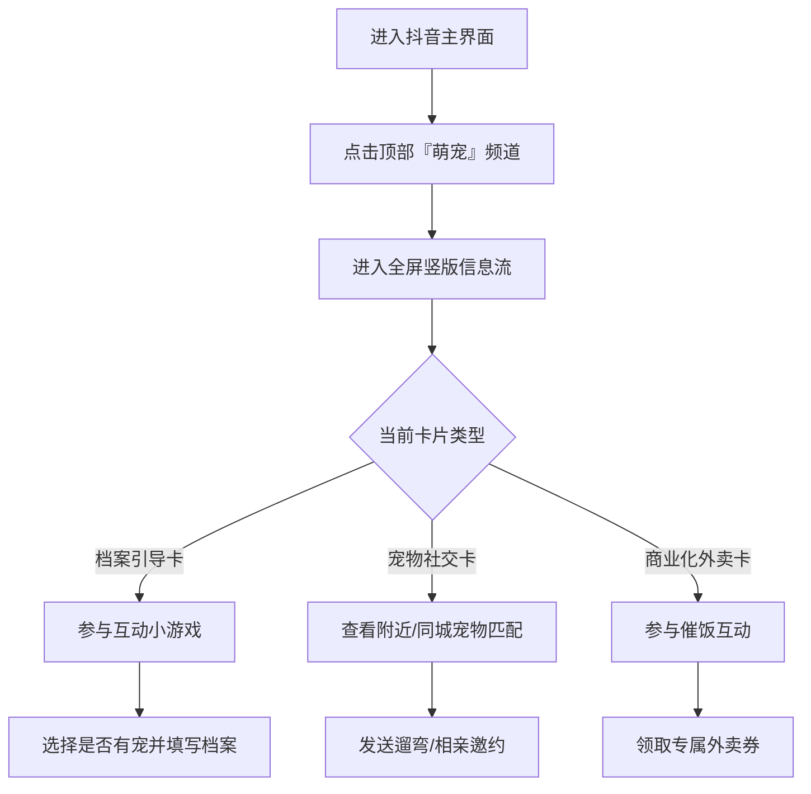

## 1. 产品概述
本项目旨在基于现有抖音架构，开发一个专属的「萌宠」频道页面。
- 核心目的是通过“治愈感+强互动+场景化”的AI宠物卡片替代传统视频内容，打造沉浸式、无学习成本的全屏竖版信息流体验。
- 满足养宠及云养宠用户的娱乐、社交与消费需求，通过场景触发（时间、位置、节气等）提供精准互动。

## 2. 核心功能

### 2.1 用户角色
| 角色 | 注册方式 | 核心权限 |
|------|----------|----------|
| 养宠用户 | 抖音主站账号授权 | 浏览频道、填写宠物档案、参与同城宠物社交、领取专属场景福利 |
| 云养宠用户 | 抖音主站账号授权 | 浏览治愈系萌宠卡片、参与互动小游戏 |

### 2.2 功能模块
1. **顶部导航栏**：抖音标准顶部频道切换（推荐、同城、萌宠等）。
2. **全屏竖版信息流**：支持上下滑动切换卡片的沉浸式浏览容器。
3. **卡片1：宠物档案引导卡（毛孩子初遇计划）**：包含Q版萌宠轻量互动小游戏与档案收集弹窗。
4. **卡片2：宠物社交卡（毛孩子社交局）**：基于LBS和宠物档案的场景化社交（遛弯局、寻伴计划）。
5. **卡片3：商业化外卖卡（毛孩子催饭记）**：基于时间场景（晚间）的拟人化催饭互动与外卖券发放。

### 2.3 页面详情
| 页面名称 | 模块名称 | 功能描述 |
|----------|----------|----------|
| 萌宠频道主页 | 频道导航 | 顶部Tab切换，新增「萌宠」入口高亮显示。 |
| 萌宠频道主页 | 滑动信息流 | 全屏上下滑动切换机制，自动播放/加载卡片动画及音效。 |
| 档案引导卡 | 互动小游戏 | 点击“坐下/握手/转圈”指令，萌宠执行对应动画；完成后弹出身份选择与档案填写表单。 |
| 宠物社交卡 | 遛弯局/寻伴计划 | 展示附近同品类宠物列表，支持横向滑动；提供“约遛弯”/“打招呼”交互，并弹出成功提示。 |
| 商业化外卖卡 | 晚间催饭互动 | 晚间时段触发，小狗肚饿动画；提供“已吃/未吃”选项，未吃则弹出场景化外卖券浮层。 |

## 3. 核心流程
用户进入抖音 -> 点击顶部「萌宠」频道 -> 进入竖版信息流 -> 上下滑动浏览AI宠物卡片 -> 根据卡片类型进行互动（玩游戏建档案/约遛狗/领外卖券）。

## 4. 用户界面设计
### 4.1 设计风格
- **主色调**：抖音黑底模式（沉浸式），卡片辅色采用温暖治愈系（如暖黄、莫兰迪粉、治愈绿）。
- **按钮风格**：大圆角、微拟物/果冻质感，增强点击欲望，符合“软萌”设定。
- **字体**：清晰易读的无衬线字体，特殊弹窗和提示语可采用圆润可爱的卡通风格字体。
- **布局风格**：全屏卡片式布局，右侧/底部保留抖音标准互动区（点赞、评论、分享）的视觉占位，主体为居中的互动卡片。
- **动效与音效**：丰富的微交互动效（小狗跳跃、摇尾巴、摸肚子）与软萌音效搭配。

### 4.2 页面设计总览
| 页面名称 | 模块名称 | UI元素 |
|----------|----------|--------|
| 萌宠频道 | 信息流容器 | 黑色沉浸背景，隐藏式滚动条，平滑分页吸附效果。 |
| 档案引导卡 | 互动区 | Q版3D/2D萌宠形象，底部3个指令按钮，气泡式拟人化对话框。 |
| 宠物社交卡 | 匹配列表 | 顶部场景标题，居中横滑的宠物头像卡片（含距离/标签），底部行动号召按钮。 |
| 商业化卡片 | 领券浮层 | 萌宠端餐盘视觉元素，醒目的外卖券面（金额、门槛），趣味文案选项按钮。 |

### 4.3 响应式
- **移动端优先（Mobile-first）**：严格遵循手机端全屏竖向比例（如9:16），适配各种手机屏幕尺寸，支持手势滑动与触摸优化。
