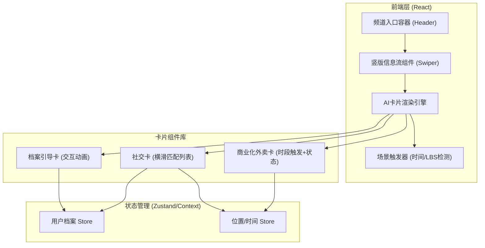
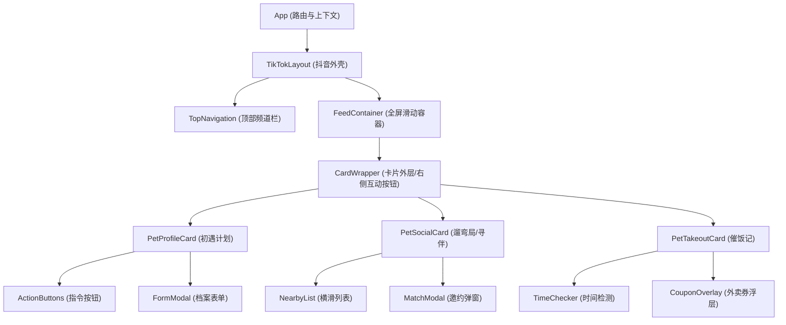

## 1. 架构设计


## 2. 技术栈说明
- **前端框架**：React@18 + Vite
- **样式方案**：Tailwind CSS@3 + Framer Motion（用于处理复杂的卡片入场及微交互动效）
- **手势与滑动**：Swiper.js 或 react-use-gesture（实现抖音上下滑分页吸附效果）
- **图标与插画**：Lucide React + Webp动画/CSS动画（模拟Q版萌宠）

## 3. 路由定义
| 路由 | 用途 |
|------|------|
| `/` | 抖音主界面模拟（含顶部导航栏，展示「推荐/同城/萌宠」） |
| `/channel/pets` | 萌宠频道页（全屏竖版信息流核心页面） |

## 4. API 定义 (Mock 数据层)
由于本项目重点在前端页面交互与视觉复原，不依赖后端，数据层采用前端 Mock：

```typescript
// 用户档案
interface UserProfile {
  hasPet: boolean;
  petType?: string; // e.g. 'dog', 'cat'
  petName?: string;
  petAge?: number;
  inEstrus?: boolean; // 发情期
}

// 附近宠物
interface NearbyPet {
  id: string;
  name: string;
  type: string;
  distance: string;
  tags: string[]; // e.g. ['温顺亲人', '活泼好动']
  image: string;
}
```

## 5. 组件层级图

